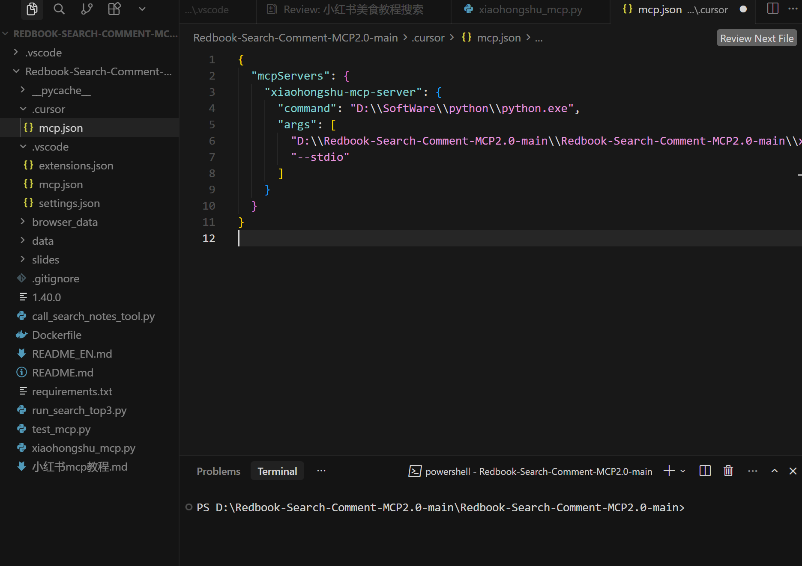
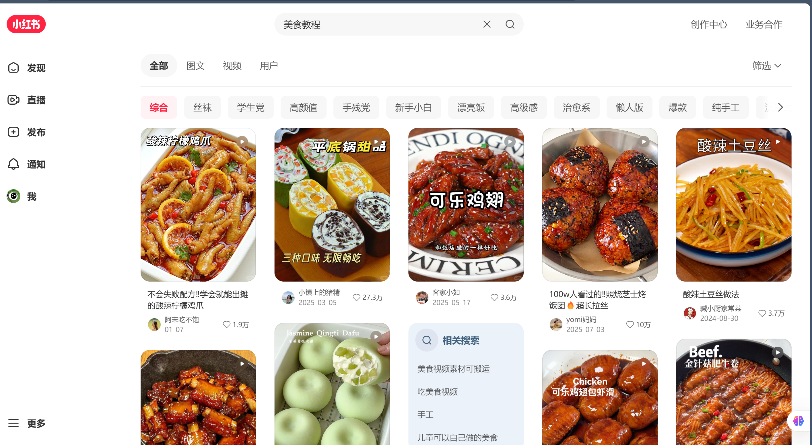

# 小红书 MCP 配置
## 自动化运营完全指南

✨ AI 驱动 · 小红书内容智能运营新范式 ✨

SMART CONTENT MANAGEMENT · 2026

---
background: https://picsum.photos/1920/1080?dark=2
layout: center
---

# 📋 完整目录

**01** 引言：痛点 & 核心价值解析 
**02** 准备工作：前置环境完整配置 
**03** 部署教程：本地服务搭建分步流程

**04** AI 客户端接入：工具适配 + 参数配置 
**05** 实战演示：从零全自动发布第一篇笔记 
**06** 高级自定义配置 & 报错排查方案

---
background: https://picsum.photos/1920/1080?dark=3
layout: section
---

# 🔑
## 解锁小红书自动化运营的钥匙

---
background: https://picsum.photos/1920/1080?dark=4
layout: center
---

# 当下小红书运营痛点

❌ 传统手动运营低效难题

| 痛点 | 影响 |
|------|------|
| ✍️ 手动写稿、排版、配图 | 耗时耗力效率低 |
| 🔄 多账号来回切换登录 | 操作繁琐易触发风控 |
| ⏰ 无定时发布、批量发稿能力 | 无法规模化运营 |
| 🚪 官方 API 门槛高、审核严 | 个人开发者难以接入 |
| 💻 不懂代码开发 | 无法搭建专属自动化体系 |

---
background: https://picsum.photos/1920/1080?dark=5
layout: center
---

# 什么是 MCP

## Model Context Protocol
### 模型上下文协议

✅ AI 与外部平台/工具的 <strong style="color:#E6C27A;">标准通用连接桥梁</strong>

✅ 突破纯文本对话限制，赋予 AI 真实落地执行能力

✅ 小红书生态专属定制自动化中间通信协议

✅ 零基础无需开发，即可让 AI 直接操控平台运营

✅ 统一通信规范，全兼容主流 AI 客户端与本地服务

---
background: https://picsum.photos/1920/1080?dark=6
layout: center
---

# 为什么选择 MCP

## 规避官方高门槛 API · 低成本零基础入局

✅ 标准化统一调用接口

✅ 自动化登录 + Cookie 持久化

✅ 内置访问频率限流策略

✅ 一站式全功能运营

✅ 本地私有化部署 · 数据安全

✅ 跨平台适配 Win/Mac/Linux

---
background: https://picsum.photos/1920/1080?dark=7
layout: section
---

# 🛠️
## 准备工作：部署前置环境配置

---
background: https://picsum.photos/1920/1080?dark=8
layout: center
---

# 系统与硬件要求

<table style="width: 100%;">
<tr><td style="color:#F472B6;">💻 <strong>支持系统</strong></td><td style="color:#D0D0E0;">Windows 10+ / macOS 12+ / Linux x64</td></tr>
<tr><td style="color:#F472B6;">⚙️ <strong>硬件配置</strong></td><td style="color:#D0D0E0;">双核 CPU / 4G 内存及以上</td></tr>
<tr><td style="color:#F472B6;">🌐 <strong>网络要求</strong></td><td style="color:#D0D0E0;">稳定国内网络，无需科学上网</td></tr>
<tr><td style="color:#F472B6;">🔐 <strong>权限要求</strong></td><td style="color:#D0D0E0;">管理员权限，关闭防火墙拦截</td></tr>
</table>

---
background: https://picsum.photos/1920/1080?dark=9
layout: center
---

# 必备前置依赖

| 依赖项 | 说明 |
|--------|------|
| 🔧 **Node.js** | 必须安装 LTS 长期支持版本 |
| 📁 **文件目录** | 纯净无中文路径的解压目录 |
| 🧩 **浏览器** | Chrome / Edge 用于扫码登录 |
| 📝 **文本编辑器** | 用于配置文件参数修改 |

---
background: https://picsum.photos/1920/1080?dark=10
layout: center
---

# 🚀 快速准备流程

1️⃣ 下载 MCP 服务压缩资源包

2️⃣ 解压至 <strong style="color:#E6C27A;">纯英文无空格</strong> 路径文件夹

3️⃣ 安装配置 Node.js 环境并校验版本

4️⃣ 关闭电脑防火墙/杀毒软件拦截

5️⃣ 准备小红书可用账号用于后续登录认证

---
background: https://picsum.photos/1920/1080?dark=11
layout: section
---

# 📦
## 部署教程：保姆级服务搭建

---
background: https://picsum.photos/1920/1080?dark=12
layout: center
---

# 部署三步曲 · 完整流程

🔹 步骤一 · 账号登录与身份认证 
<small style="color: #8B8B9A;">打开本地登录页面 → 小红书 APP 扫码授权 → 会话自动保存</small>

🔹 步骤二 · 本地服务启动与端口监听 
<small style="color: #8B8B9A;">终端执行启动命令 → 默认端口占用检测 → 后台常驻运行</small>

🔹 步骤三 · 服务连通性检测与环境校验 
<small style="color: #8B8B9A;">访问本地测试地址 → 查看服务状态 → 校验接口连通性</small>

---
background: https://picsum.photos/1920/1080?dark=13
layout: section
---

# 🔌
## 接入 AI 客户端

---
background: https://picsum.photos/1920/1080?dark=12
layout: center
---

# 主流客户端无缝适配

## 全平台兼容 · 一键接入

🔹 Cursor 编辑器
🔹 VS Code 各类 AI 插件
🔹 OpenClaw 智能客户端
🔹 其他支持 MCP 协议的 AI 工具

---
background: https://picsum.photos/1920/1080?dark=15
layout: center
---

# 客户端配置核心步骤

1️⃣进入 AI 客户端 MCP 配置面板
2️⃣填写本地服务地址 + 监听端口
3️⃣填入授权密钥与基础请求参数
4️⃣保存配置并重启客户端服务
5️⃣测试连接状态，显示连通成功即可

✨ <strong style="color:#E6C27A;">AI 能力赋能</strong> 
配置完成后，AI 可直接驱动：文案生成 · 自动排版 · 图文发布 · 定时推送 · 账号运维全流程

---
background: https://picsum.photos/1920/1080?dark=16
layout: section
---

# 🎬
## 实战演示：自动化发布笔记

---
background: https://picsum.photos/1920/1080?dark=17
layout: center
---

# 全自动闭环运营流程

📝 内容准备 → AI 自动生成标题/文案/标签

🤖 AI 指令下发 → 调用 MCP 服务接口

🖼️ 自动图文匹配 → 配图上传 + 格式自动排版

🚀 一键自动发布 → 实时提交小红书平台

📊 发布结果回显 → 客户端查看状态与笔记链接

✨ 全程无人干预，零基础实现全链路自动化 ✨

---
background: https://picsum.photos/1920/1080?dark=18
layout: section
---

# ⚙️
## 高级配置 & 常见问题

---
background: https://picsum.photos/1920/1080?dark=19
layout: center
---

# 高级自定义配置

⚙️ 自定义服务端口修改

⚙️ 多账号批量管理配置

⚙️ 定时发布任务规则设置

⚙️ 内容模板自定义预设

⚙️ 接口 API 调用参数示例

---
background: https://picsum.photos/1920/1080?dark=20
layout: center
---

# ⚠️ 风险提示 & 合规运营

🚫 禁止批量违规营销、恶意引流

🚫 控制发布频率，规避平台限流封号

🚫 遵守小红书社区规范，合规创作运营

🚫 仅用于个人学习与正常内容创作使用

---
background: https://picsum.photos/1920/1080?dark=21
layout: center
---

# 常见问题排查

<table style="width: 100%;">
<tr><td style="color:#F472B6;">❌ 端口被占用</td><td style="color:#A0A0B0;">→ 修改配置端口重启服务</td></tr>
<tr><td style="color:#F472B6;">❌ 连接失败</td><td style="color:#A0A0B0;">→ 检查网络/防火墙/参数填写</td></tr>
<tr><td style="color:#F472B6;">❌ 登录失效</td><td style="color:#A0A0B0;">→ 清空会话缓存重新扫码</td></tr>
<tr><td style="color:#F472B6;">❌ 发布失败</td><td style="color:#A0A0B0;">→ 检查文案合规性/图片格式大小</td></tr>
</table>

---
background: https://picsum.photos/1920/1080?dark=22
layout: end
---

## 感谢观看

### 小红书 MCP 智能自动化运营 · 一站式落地教程

✨ 让 AI 成为你的小红书运营助手 ✨
